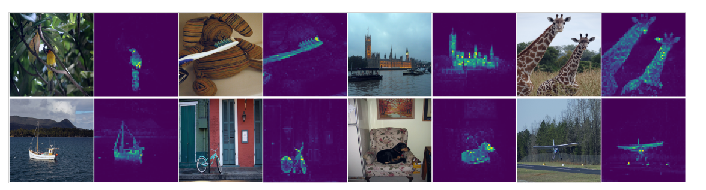

# Emerging Properties in Self-Supervised Vision Transformers(dino)

원문: https://arxiv.org/abs/2104.14294  
저자: Facebook AI Research  
태그: Computer Vision  

## Abstract

자기 지도 학습이 Convolutional Neural Network (CNN)와 비교할 때 Vision Transformer 가 새로운 property(속성, 성질)을 제공하는지에 대해 질문하는 것입니다

이 아키텍쳐는 자기 지도 학습을 적용하는 것이 잘 작동하는 것 외에도 2가지 관찰을 하였습니다.

1. 자기 지도 ViT feature는 지도 학습 ViT나 CNN과 같이 명확하게 나타나지 않는 이미지의 시맨틱 분할(semantic segmentation)을 포함합니다.
2. feature는 small vit로 imagenet에서 top-1에 도달한 KNN분류기 입니다

연구는 momentum encoder와 multi-crop training, vit는 작은 패치를 사용하는 것의 중요성을 강조하였습니다

DINO라고 불리는 간단한 자기 지도 학습 방법으로 연구 결과를 구현하는데, 이는 label이 없는 **self-distillation**의 한 형태로 해석 할 수 있습니다.

## Introduction

Transformer는 visual recognition(시각 인식)을 위한 convnet의 대안으로 등장했습니다

VIT는 Conv net과 경쟁력이 있지만 아직 까지는 확실한 이점을 제공하지 않습니다

⇒ 계산적으로 더 까다롭고, 많은 교육데이터와 feature 가 필요하기 때문

논문에서는 muted success vit가  사전학습된 지도학습으로 설명될 수 있는지 의문을 제기합니다.

motivation은 NLP에서 Transformer성공 요소 중 하나는 self-supervised pretraining을 사용한 BERT와 GPT와 같은 모델링의 형태였기 때문입니다.

self-supervised pretraining의 목표는 문장의 단어를 사용하여 문장 단위의 단일 label을 예측하는 지도학습보다 더 많은 학습 signal을 제공하는 것입니다.

마찬가지로 이미지에서도 이미지 supervision은 이미지에 포함된 시각정보를 수천 개의 categorical object 를 미리 정해둔 세트에서 선택된 단일 개념으로 축소합니다.

기존의 많은 self-supervised방법은 convnet이 있는 이미지에서 사용하는 것이 일반 적이였습니다.

이러한 방법들은 일반적으로 비슷한 구조를 공유하지만 trivial solutions (collapse) or 성능 향상을 위해 설계된 다른 구성 요소를 사용합니다.

이 방법에서 영감을 받아 self-supervised pretraining 이 VIT feature에 미치는 영향을 연구하였습니다.

우리는 supervised ViT나 convnet에서 나타나지 않는 특성을 확인하였습니다

1. Self-supervised ViT features 는 그림 1과 같이 장면 레이아웃, 특히 객체 boundaries를 명시적으로 포함 하고 이 정보는 마지막 블록의 self-attention modules에서 access할 수 있습니다.

그림1

1. Self-supervised ViT features는 finetuning, linear classifire, dataaugmentation 없이 kNN으로 잘 수행

segmentation masks의 출현은 self-supervised pretraining을 통해 특성을 이런 특성을 추출 할 수 있음.

KNN의 높은 성능은 **multi-crop augmentation** 또는 **momentum encoder**와 같은 특정 구성요소를 결합할 때만 나타나고, result feature의 품질 향상을 위해 vit에 더 작은 패치를 사용하는 것이 중요합니다.

우리의 발견은 라벨이 없는 knowledge distillation의 한 형태로 해석될 수 있는 간단한 self-supervised 을 설계하도록 했습니다.

teacher network는 momentum encoder이고 student network는 더 작은 해상도를 사용하여, teacher network의 출력을 예측하도록 훈련합니다. (cross entopy loss 사용)

model collapse를 피하기 위해 teacher output의 centering & sharpening할 수 있지만 예측 변수[****Bootstrap your own latent: A new approach to self-supervised Learning****], 정규화, 대조손실(contrastive loss)과 같은 것은 성능 측면에서 이점을 제공하지 않았습니다.

⇒ DINO는 아키텍쳐를 수정하거나 내부 정규화 없이 convnet과 vit 모두에서 작동합니다

작은 패치가 있는 vit base로 imagenet 선형 분류 벤치마크에서 이전의 self-supervised feature를 능가 해서 dino와 vit간의 시너지 검증함

그림2 Self-distillation with no label

단순성을 위해 단일 쌍(x1, x2)의 경우 DINO 설명함. 이 모델은 입력 이미지의 두 가지 다른 무작위 변환을 teacher, student network에 전달 합니다. 두 네트워크 모두 아키텍쳐는 같지만 파라미터는 다릅니다.

teacher의 출력은 배치에 대해 계산된 평균으로 `중심화(centering)` 하며, 각 네트워크의 출력은 feature 차원에 대한 temperature softmax로 정규화된 K 차원의 feature를 출력합니다.

유사도는 cross entropy loss로 계산 합니다.

stop gradient 연산자를 teacher에 적용하여 student를 통해서만 gradient를 전파함

teacher의 파라미터는 student의 exponential moving average(지수 이동 평균 EMA)로 업데이트됨

⇒ model의 model collapse방지 목적

## 3. Approach

### 3.1. SSL with Knowledge Distillation

DINO는 최근의 self-supervised 접근법과 동일한 구조를 공유하지만 knowledge distillation와도 유사성을 공유합니다.

knowledge distillation은 주어진 gt(teatcher net)의 출력과 일치하도록 gs(student net)를 훈련하는 것으로 각 us, ut로 파라미터화됩니다.

입력 이미지 x가 주어지면 두 네트워크는 Ps, Pt로 표시된 K차원의 확률 분포를 출력하고 확률 P는 네트워크 g의 출력을 소프트맥스로 정규화하여 구할 수 있습니다.

출력 분포의 **`sharpness`** 및 ut에서 Pt에 대해 유사한 fomula가 유지됩니다.

gt가 주어지면 우리는 gs의 파라미터(θs)에 대한 cross entropy loss를 최소화 함으로 분포를 일치시키는 방법을 학습합니다.

(2)의 문제를self-supervised learning에서 어떻게 적용하는지 설명

- 멀티크롭을 사용하여 이미지의 다른 왜곡된 view또는 crop을 구성 ⇒ 정확하게는 이미지에서 서로 다른 뷰의 세트 V를 생성
- 이 세트는 두개의 global view(x g1) 및 (x g2)가 포함
- 모든 crops는 studnet를 통해 전달되고 global view만 teacher를 통해 전달 되므로 local-to-global 대응을 촉진하여 전체 이미지의 컨텍스트를 이해하는 것에 도움이 됨

We minimize the loss:

2개의 뷰만 포함하여 임의의 수의 뷰에 사용할 수 있음

원본 이미지의 큰 영역(예: 50% 이상)을 다루는 해상도 2242의 2개 글로벌 뷰와 원본 이미지의 작은 영역(예: 50% 미만)만 다루는 해상도 962의 여러 로컬 뷰를 사용하여 멀티 크롭에 대한 표준 설정을 따름. 달리 언급되지 않는 한, 이 설정을 DINO의 기본 매개 변수화라고 부릅니다.

두 네트워크는 서로 다른 매개 변수 집합과 함께 동일한 아키텍처 g를 공유하고. 각각의 네트워크는 서로 다른 매개 변수 집합을 가집니다.  확률적 경사 하강법으로 (3)를 최소화하여 매개 변수 µs를 학습한다.

### Teacher network

선행적으로 주어진 teacher(gt)가 없기 때문에 student의 **`past iterations`**으로 모델을 구성합니다.

교사에 대한 epoch마다 교사 네트워크를 동결하는 것과 `**different update rules**`을 적용 하는 것이 잘 작동하고 교사에 대한 학생 가중치를 복사하는 것은 수렴하지 못합니다.

학생 가중치에 대해 EMA, momentum encoder를 사용하는 것이 적합하며

업데이트 규칙 θt ← λθt + (1 − λ)θs임  λ는 훈련중 0.996 ~ 1까지 cosine scheduling을 따릅니다

momentum encoder 는 원래 대조학습에서 queue를 대체하기 위해 도입되었으나 DINO에서는 queue나 대조손실을 가지고 있지 않기 떄문에 다르며 자기 훈련에 사용되는 mean teacher에 가까울 수 있습니다.

이 교사가 지수 감소로 Polyak-Ruppert 평균과 유사한 모델 앙상블의 형태를 띄며 모델 앙상블에 PolyakRuppert 평균화를 사용하는 것은 모델의 성능을 향상시키기 위한 일반적인 방법 중 하나입니다.

### **Avoiding collapse**

self-supervised 방법마다 collapse를 방지하기 위해 다른 방법을 사용하는데 예시로는 contrastive loss, clustering constraints, predictor or batch normalizations이 있습니다.

DINO도 multiple normalizations으로 안정화될 수 있지만 centering과 sharpening만으로도 할 수 있습니다.

centering은 한 개의 차원이 dominate하는 것을 막지만, uniform distribution으로 수렴하게 만듦. sharpening은 그 반대로 작용합니다.

⇒ 두 연산 모두 적용하면 collapse를 방지 가능

center c는 EMA로 업데이트 

---
**용어정리**

**model collapse** = 모든 입력에 대해 동일한 embedding을 출력하는 현상

또 representation learning의 경우, contrastive learning으로 학습하는 경우가 많다.

contrastive learning이란 같은 이미지(positive pair)끼리는 embedding vector가 가깝게 나오도록, 다른 이미지(negative pair)끼리는 멀어지도록 metric learning 하는 것이다.

여기서 negative pair를 꼭 써주는 이유가 있는데, positive pair만을 사용하는 경우 **Collapsing**이 일어나기 때문이다.

이렇게하면 네트워크 입장에서 계속 같은(augmentation돼서 아예 동일하진 않지만) 이미지끼리 embedding vector를 가깝게 하는 것으로 받아들이고 네트워크는 계속 둘이 같은 이미지(similarity=1)이 되도록 embedding vector를 output한다.

그래서 두 경우 모두, **constant**를 output한다고 표현하기도 한다.

VIT 모델에서 **model collapse**가 발생하는 이유는 다양한 학습 데이터를 사용해야 하는데, 데이터가 다양하지 않거나 특정 클래스의 이미지가 균등하지 않거나, 특정 클래스에서만 집중하여 feature를 추출하기 때문임

**centering =** teacher의 출력(feature)을 배치 단위로 정규화하기 위해 사용하는 것

배치마다 feature의 평균을 계산하고 이를 feature에서 빼줌으로 centering 수행

**sharpness =** 출력값의 확률 분포가 얼마나 peaky한지

sharpness가 높으면 클래스에 대한 예측 신뢰도가 높고 낮으면 클래스간 구별이 어려워짐

⇒ student network의 출력 분포가 teacher의 출력 분포와 유사하도록 해야함

**past iterations =** student 모델의 이전 학습 단계에서 생성된 모델의 가중치(weight)와 편향(bias) 

**different update rules =** EMA나 Momentum Encoder를 사용하는 것