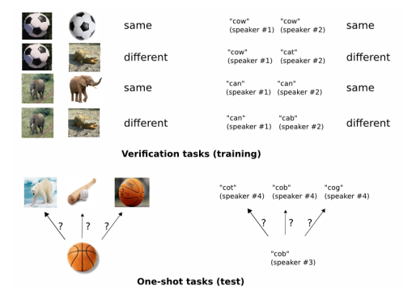

# Siamese Neural Networks for One-shot Image Recognition

Year: 2015  
원문: https://www.cs.cmu.edu/~rsalakhu/papers/oneshot1.pdf  
저자: Gregory Koch, Richard Zemel, Ruslan Salakhutdinov  
태그: Computer Vision  

## Abstract

보통의 ML은 좋은 feature를 학습하는 과정이 힘들고, 데이터가 적을 경우 어려울 수 있습니다.

이럴 경우 one-shot learining을 사용하는데, 한 개의 새로운 클래스를 사용하여 예측을 하는 것을 말합니다

여기서는 샴 네트워크를 학습하는 방식을 제안하며, 이 네트워크는 입력값 간의 유사도에 순위를 매기는 구조를 가집니다. 네트워크가 조정된 , `discriminative features`를 활용하여 새로운 데이터 뿐 아니라 알려지지 않은 분포에서 나타나는 새로운 클래스에 일반화 될 수 있습니다. convolution network를 사용할 때 one-shot classification에서 sota를 달성 했습니다.

one-shot learning은 하나의 클래스에 하나의 예제가 있는 조건에서 이루어 집니다. 이는 zero-shot learning과 구분 되는데 zero-shot learning은 클래스에 대한 예제가 없습니다. one-shot learning은 유사한 데이터에 대해서는 성능이 높지만 다른 데이터에 대해서는 성능이 낮습니다. 여기서는 입력 구조에 대한 가정을 제한하고 예제를 들어 모델이 성공적으로 일반화할 수 있는 feature를 자동으로 학습하는 새로운 접근방식을 사용합니다.

## Approach

Siamese network는 지도 학습으로 이미지 표현을 학습하고, 재학습 없이 feature를 one-shot learning에 사용합니다.

이 논문에서는 문자 인식에 초점이 맞춰져있지만 이 접근 방식은 거의 모든 모달리티(일반적으로 사용 가능)에 대해 사용할 수 있습니다. 이를 위해, Siamese Convolutional Neural Networks를 사용하는데, 이는 a) 새로운 분포에서 매우 적은 예제만 사용해도 예측에 유용한 일반적인 이미지 특징을 학습할 수 있고, b) 원본 데이터에서 샘플링된 쌍에 대해standard optimization techniques을사용하여 쉽게 훈련될 수 있으며, c) 도메인 특정 지식에 의존하지 않고 딥러닝 기술을 활용하여 경쟁력 있는 방법을 제공합니다.

one-shot 이미지 분류를 위해 이미지 쌍의 클래스를 구분할 수 있는 신경망을 먼저 학습해야 합니다. 입력 쌍이 동일한 클래스인지, 아닌지를 확률로 해석하여 학습을 하게되고 모델은 새로운 이미지를 클래스마다 하나씩 가져와 테스트 이미지와 짝으로 비교합니다.

모델은 다양한 알파벳을 학습하여 학습된 feature가 다양하게 분포되야 합니다.(모델이 일반화 되어야함)

## Deep Siamese Networks for Image Verification

siamese network는 서로 다른 입력을 받지만 `energy function` 에 의해 결합 되는 twin networks로 구성됩니다. 각 네트워크의 파라미터는 공유되고 각 네트워크는 highestlevel feature representation 를 출력하고 출력값 간의 유사도를 계산하여 두 출력 사이의 거리를 계산 합니다. 네트워크는 대칭적이므로 (input1, input2) 의 결과와 (input2, input1)의 결과가 같아야합니다.

두 개의 비슷한 이미지가 다른 feature space에 매핑될 경우는 없습니다.

이 논문에서는 feature vector h1과 h2간의 `L1 distance`를 `sigmoid` 활성화 함수를 사용하여 0~1사이의 값으로 출력합니다. 그 후, `cross entropy`를 loss function으로 사용하여 네트워크를 학습합니다.

## Model

(여기서 부터는 논문 모델이니까 간략하게만)

기본 모델은 L개의 layer 가 있는 siamese convolutional neural network 를 사용하였습니다. 각 layer는 $L_l$개의 unit이 있고첫번째 쌍의  $l$번째 layer 에서 hidden vector는  $h_1,_l$로 표현되고 두번째 쌍은 $h_2,_l$로 표현 됩니다. 첫 $L-2$ layer는 Relu를 사용하고 나머지는 sigmoid를 사용합니다.

각 layer는 크기가 다른 filter와 1의 stride를 사용하는 단일 채널 을 사용합니다. fileter 수는 성능 최적화를 위해 16의 배수로 지정됩니다. 각 네트워크의 output feature map에는 Relu를 적용하고 filter 와 stride가 2인 amxpooling을 선택하여 사용합니다 

각 layer의 k번째 filter map은 다음과 같습니다.

$$
a^{(k)}{1,m} = \text{max-pool}\left(\text{max}\left(0, W^{(k)}{l-1,l} * h^{(l-1)}_{1} + b^{(l)}\right), 2\right)
$$

$$
a^{(k)}{2,m} = \text{max-pool}\left(\text{max}\left(0, W^{(k)}{l-1,l} * h^{(l-1)}_{2} + b^{(l)}\right), 2\right)
$$

여기서 $W_l-1$은 $l$번째 layer의 feature map을 나타내는 3차원 tensor이며 *는 filter와 feature map 간의 `valid convolutional operation`일 때만 출력 unit을 return 하겠다는 것입니다(출력 크기를 줄이는 padding이 없음)

마지막 convolution layer는 flatten 하여 하나의 vector로 만듭니다. 이는 fully connected layer로 연결되며 그 다음 출력 값 간의 거리를 계산하는 layer가 있습니다. 이 layer는 sigmoid로 연결됩니다.

prediction vector:

$$
P = \sigma \left(\sum_{j} \alpha_j \left\vert h_{1,L-1}^{(j)} - h_{2,L-1}^{(j)} \right\vert \right)
$$

여기서 $\alpha$는 sigmoid

마지막 layer는 (L-1)번째 hidden layer의 feature space에서 거리를 측정해 두 feature vector간의 유사도를 계산합니다. $\alpha_j$는 거리의 중요도를 weight로 학습되는 parameter

---

### 용어

discriminative features: 클래스 간 차이를 잘 나타내는 feature

valid convolutional operation: 입력 데이터와 filter사이에 완전히 겹쳐지는 부분에 대해서만 출력