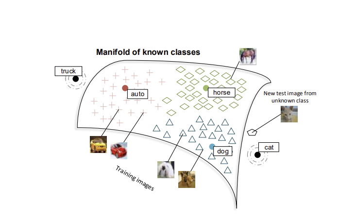

# Zero-Shot Learning Through Cross-Modal Transfer

Year: 2013  
원문: https://arxiv.org/abs/1301.3666  
저자: Richard Socher, Milind Ganjoo, Hamsa Sridhar, Osbert Bastani, Christopher D. Manning, Andrew Y. Ng  
태그: Computer Vision

# Abstract

객체에 대한 훈련 데이터 없이 이미지에서 객체를 인식할 수 있는 모델을 소개합니다.

보이지 않는 범주에 대한 necessary한 지식은 unsupervised된 큰 말뭉치에서 나옵니다.

zero-shot frame work에서 언어의 분포에 대한 정보는 객체가 어떻게 생겼는지 이해하기 위한 의미적 기반으로 작용할 수 있습니다. 

대부분의 지난 zero-shot learning model은 unseen class만 구별할 수 있었습니다.

그에 비해 이 모델은 수천 개의 훈련 이미지가 있는 클래스에서 높은 성능을 얻을 수 있고 보이지 않는 클래스에도 적당한 성능을 얻을 수 있습니다.

먼저 semantic 공간에서 이상치를 탐지하고, 두 개의 다른 recognition models을 사용합니다. 또한 우리의 모델은 단어, 이미지에 대해 수동적으로 정의된 `semantic feature`를 필요로 하지 않습니다

# Introduction

zero-shot learning은  라벨링이 적게된 데이터나 신제품, 차와 같이 계속 새로운 시각적 정보가 많은unseen visual class를 분류하는데 유용합니다.

unseen object를 분류하기 위해 자연어로 이뤄진 많은 시각적 정보를 활용하는 방법을 제시합니다. 이는 사람이 객체에 대한 정보를 읽기만 해도 인식할 수 있는 능력을 모델링 하려는 것을 시도하는 것입니다. 예를들어 위에 서서 스틱으로 움직이는 이륜 자동차에 대한 설명을 읽은 후, 이전에 본 객체와 다르더라도 많은 사람들은 Segway를 분류할 수 있을 것입니다. 

우리는 seen and unseen classes를 모두 예측할 수 있는 zero-shot 모델을 소개합니다. 예를들어 고양이 이미지를 보지않고 개, 말과 같은 training set에서 이미지가 고양이인지 알려진 카테고리인지 확인할 수 있습니다. 이 모델은 두가지 아이디어를 기반으로 합니다

1. 이미지는 신경망 모델에서 학습된 단어의 semantic space에 매핑됩니다. 단어 벡터는 큰 unsupervised text corpus에서 분포적 유사성을 판단합니다. 이 공간에 대한 이미지 매핑을 학습함으로써 단어 벡터는 Visual modality에 의해 암시적 바탕을 갖추게 되고 따라서 다양한 단어들에 대한 대표적인 예시를 제공할 수 있습니다.
2. classifiers는 학습예제를 본 클래스에 예측하려 하기 떄문에 이 모델은 새로운 이미지가 이미 알려진 범주의 매니폴드에 있는지를 결정하는 이상치 탐지확률을 포함합니다. 만약 이미지가 알려진 범주에 속한다면 standard classifier를 사용할 수 있고 그렇지 않다면, 이미지는 unseen category로 할당됩니다. 이상치, unseen caterogy일 확률은 확률 모델에 통합됩니다. (Fig 1)

Fig 1 

intermediate features만 예측하거나 다양한 zero-shot class를 구분할 수 있는 이전 모델과는 달리 우리 모델은 알려진 class에 대해서 높은 성능을 보이고 zero-shot class에 대해서도 괜찮은 성능을 보입니다. knowledge transfer와 달리 우리는 zero-shot class에 대해 수동으로 정의된 속성을 필요로 하지 않고 우리의 language feature representations는 unsupervised 및 unaligned corpora에서 학습됩니다.

## Word and Image Representations

단어와 이미지의 특성 표현에 대한 설명

분포 기반 접근법은 단어 간 의미 유사성을 파악하는데 흔히 사용됩니다. 이는 단어가 문맥에서 다른 단어와 함께 출현하는 빈도수 등 분포 특성의 벡터로 표현됩니다.

여기서는 50차원의 pre-training된 word vector를 사용하며 여기서 사용된 모델은 local context와 전체 문서의 global context를 모두 사용합니다. 이러한 local co-occurrence 기반의 벡터 공간 모델은, 결과적으로 distributional syntactic and semantic 정보를 포착하게 됩니다

이미지 특징 추출은 비지도학습을 사용하여 F개의 image feature를 뽑고, 이를 통해 x ∈ R^F인 벡터로 나타낼 수 있습니다. 

## Projecting Images into Semantic Word Spaces

이미지의 semantic relationships and class membership를 학습하기 위해 이미지의 featuer vector를 50차원 단어 공간으로 투영합니다. 

훈련 및 테스트중에 Y의 집합을 고려하고 이중 일부 클래스 y는 학습 데이터를 가지고 있으며 다른 클래스 는 훈련데이터가 없는 zero-shot class입니다

Ys = 학습 데이터가 있는 클래스

Yu = 학습 데이터가 없는 클래스

W = Ws U Wu는 시각적 클래스의 분포 정보를 확인하는 seen, unseen클래스를 모두고려하는 단어 벡터 집합

$J(\theta) = \sum_{y \in Y_s}\sum_{x^{(i)}\in X_y}||k_wy-\theta x^{(i)}||_2^2$

loss

이미지를 단어 벡터 공간으로 투영하여 단어의 의미를 visual grounding과 연결 시킴으로 단어의 시각적 예시 또는 명사의 평균색을 찾을 수 있게 됩니다. 

## **Zero-Shot Learning Model**

일반적으로 이미지 x가 주어졌을 때 zero-shot class y∈Ys ∪ Yu에 대한 조건부 확률 p(y|x)을 예측하고자합니다.  classifier는 학습예제가 업는 클래스를 예측하지 않으므로 이미지가 seen, unseen 클래스 인지 나타내는 random변수(V ∈ {s, u})를 도입합니다.

Xs = seen 클래스의 모든 학습 이미지 feature vector 집합

We predict the class y for a new input image x via:

$p(y|x, Xs, W, \theta) = \sum_{V \in {s,u}} P(y|V, x, Xs, W, \theta)P(V|x, Xs, W, \theta)$

여기서 $P(V=u|x,Xs,W,\theta)$는 이미지가 unseem 클래스에 속할 확률입니다. outlier detection score 임계값으로 분류하여 계산할 수 있습니다. 이 점수는 시맨틱 워드 공간에 매핑된 훈련 이미지의 매니폴드(manifold)에서 계산됩니다. 가중치가 사용된 각 클래스의 매핑된 지점은 이 마진을 얻기 위해 사용됩니다.

새로운 이미지 x에 대한 아웃라이어 감지기는 이 마진 확률이 특정 임계값 T 아래인 경우 1이 되는 인디케이터 함수입니다.

$$
P(V = u|x, Xs, W, \theta) := \mathbb{1}{P(x|Xs, Ws, \theta) < T}
$$

V = s인 경우(seen) P(y|V = s, x, Xs)를 얻기 위해 어떤 classifier도 사용할 수 있습니다. 우리는 원래 F차원 feature에 대한 softmax classifier를 사용합니다. 

V = u인 zero-shot 케이스의 경우 각 zero-shot Semantic word vector 주위에  isometric Gaussian distribution(공분산 행렬이 identity matrix인 Gaussian distribution)를 가정합니다. 

⇒ 대안으로 각 테스트 지점에 대한 outlier 확률을 얻은 다음,seen, unseen class에 대한 가중 평균을 사용할 수 있습니다.

## **Conclusion**

1. 모델은 비지도로 학습된 semantic word vector representations을 사용하면 category간 knowledge transfer을 돕는데 사용할 수 있다
2. semantic manifold에서 outlier와 point를 구분하는 Bayesian framework를 사용하여 zero-shot과 classifier를 하나의 framework로 결합이 가능하다

---

---

**semantic feature: 단어의 개념의 의미를 나타내는 요소**

e.g. 사과의 semantic feature는 빨갛다, 달다, 과일 등이 있음

**Prototypical instances: 어떤 범주안의 대표적 예시**

e.g. 고양이 라는 범주에서는 귀, 털 네발 등의 특징들

**Visual modality: 시각적 정보를 인식하는 인지 체계**

**manifold: 어떤 클래스에 속하는 이미지들의 범위**

새로운 이미지가 어떤 클래스에 속하는지를 판단하는 데 사용

**language feature representations: 특징 벡터**

**unaligned corpora: 정렬되어 있지 않은 corpus**

**distributional syntactic and semantic: 단어의 의미를 파악하기 위해 단어와 함께 나타난 다른 단어들과의 관계를 살피는 방법**

**visual grounding: 시각적 정보를 사용하여 대상을 이해하거나 연결하는 것** 

논문에서는 이미지를 단어 벡터 공간으로 매핑하여 단어 의미를 시각적으로 확장하고 시각적 정보를 단어와 연결할 수 있는 기능을 하는 

**Semantic word vector: 단어의 시맨틱 의미를 수치적으로 나타내는 벡터**
